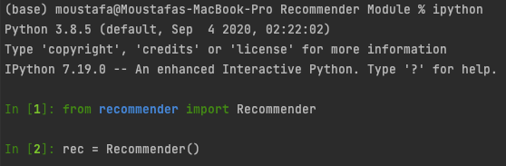
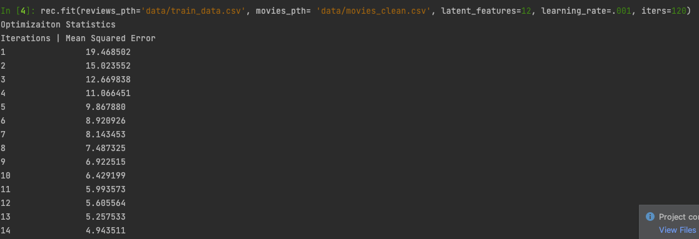
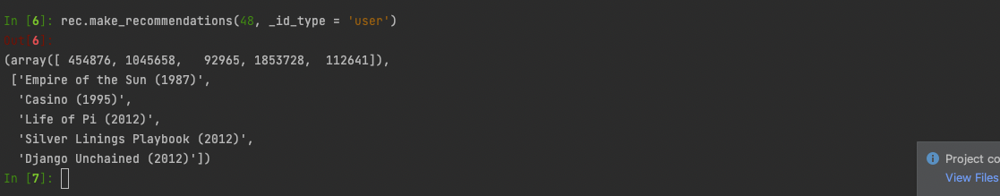

# Movietweeting, Movie Recommendation Engine
Movie Recommender Engine using data collected from Twitter

<h1>Table of Contents<span class="tocSkip"></span></h1>
<div class="toc"><ul class="toc-item"><li><span><a href="#Some-stats" data-toc-modified-id="Some-stats-1"><span class="toc-item-num">1&nbsp;&nbsp;</span>Some stats</a></span></li><li><span><a href="#A-Movie-Rating-Dataset-Collected-From-Twitter" data-toc-modified-id="A-Movie-Rating-Dataset-Collected-From-Twitter-2"><span class="toc-item-num">2&nbsp;&nbsp;</span>A Movie Rating Dataset Collected From Twitter</a></span></li><li><span><a href="#Ratings-from-Twitter" data-toc-modified-id="Ratings-from-Twitter-3"><span class="toc-item-num">3&nbsp;&nbsp;</span>Ratings from Twitter</a></span></li><li><span><a href="#Data-Preparation" data-toc-modified-id="Data-Preparation-4"><span class="toc-item-num">4&nbsp;&nbsp;</span>Data Preparation</a></span></li><li><span><a href="#The-Recommender-Engine" data-toc-modified-id="The-Recommender-Engine-5"><span class="toc-item-num">5&nbsp;&nbsp;</span>The Recommender Engine</a></span><ul class="toc-item"><li><span><a href="#Knowledge-Based-Recommendations" data-toc-modified-id="Knowledge-Based-Recommendations-5.1"><span class="toc-item-num">5.1&nbsp;&nbsp;</span>Knowledge-Based Recommendations</a></span><ul class="toc-item"><li><span><a href="#Part-I:-How-To-Find-The-Most-Popular-Movies" data-toc-modified-id="Part-I:-How-To-Find-The-Most-Popular-Movies-5.1.1"><span class="toc-item-num">5.1.1&nbsp;&nbsp;</span>Part I: How To Find The Most Popular Movies</a></span></li><li><span><a href="#Part-II:-Adding-Filters" data-toc-modified-id="Part-II:-Adding-Filters-5.1.2"><span class="toc-item-num">5.1.2&nbsp;&nbsp;</span>Part II: Adding Filters</a></span></li></ul></li><li><span><a href="#Neighbourhood-based-Collaborative-Filtering-(User-based)" data-toc-modified-id="Neighbourhood-based-Collaborative-Filtering-(User-based)-5.2"><span class="toc-item-num">5.2&nbsp;&nbsp;</span>Neighbourhood-based Collaborative Filtering (User-based)</a></span><ul class="toc-item"><li><span><a href="#Part-I:-Creating-the-User-Item-Matrix" data-toc-modified-id="Part-I:-Creating-the-User-Item-Matrix-5.2.1"><span class="toc-item-num">5.2.1&nbsp;&nbsp;</span>Part I: Creating the User-Item Matrix</a></span></li><li><span><a href="#Part-II:-Creating-a-dictionary-for-watched-movies-by-each-user" data-toc-modified-id="Part-II:-Creating-a-dictionary-for-watched-movies-by-each-user-5.2.2"><span class="toc-item-num">5.2.2&nbsp;&nbsp;</span>Part II: Creating a dictionary for watched movies by each user</a></span></li><li><span><a href="#Part-III:-Filtering-users-whom-I-could-offer-recommendations-to" data-toc-modified-id="Part-III:-Filtering-users-whom-I-could-offer-recommendations-to-5.2.3"><span class="toc-item-num">5.2.3&nbsp;&nbsp;</span>Part III: Filtering users whom I could offer recommendations to</a></span></li><li><span><a href="#Part-IV:-Calculating-User-Similarities-using-Euclidean-Distance" data-toc-modified-id="Part-IV:-Calculating-User-Similarities-using-Euclidean-Distance-5.2.4"><span class="toc-item-num">5.2.4&nbsp;&nbsp;</span>Part IV: Calculating User Similarities using Euclidean Distance</a></span></li><li><span><a href="#Part-V:-Using-the-Nearest-Neighbors-to-Make-Recommendations" data-toc-modified-id="Part-V:-Using-the-Nearest-Neighbors-to-Make-Recommendations-5.2.5"><span class="toc-item-num">5.2.5&nbsp;&nbsp;</span>Part V: Using the Nearest Neighbors to Make Recommendations</a></span></li></ul></li><li><span><a href="#Neighbourhood-based-Collaborative-Filtering-(Item-based)" data-toc-modified-id="Neighbourhood-based-Collaborative-Filtering-(Item-based)-5.3"><span class="toc-item-num">5.3&nbsp;&nbsp;</span>Neighbourhood-based Collaborative Filtering (Item-based)</a></span><ul class="toc-item"><li><span><a href="#Part-I:-Datasets-used-breakdown" data-toc-modified-id="Part-I:-Datasets-used-breakdown-5.3.1"><span class="toc-item-num">5.3.1&nbsp;&nbsp;</span>Part I: Datasets used breakdown</a></span></li><li><span><a href="#Part-II:-Identifying-users-who-still-needs-recommendations" data-toc-modified-id="Part-II:-Identifying-users-who-still-needs-recommendations-5.3.2"><span class="toc-item-num">5.3.2&nbsp;&nbsp;</span>Part II: Identifying users who still needs recommendations</a></span></li><li><span><a href="#Part-III:-Finding-similarities-between-movies-items" data-toc-modified-id="Part-III:-Finding-similarities-between-movies-items-5.3.3"><span class="toc-item-num">5.3.3&nbsp;&nbsp;</span>Part III: Finding similarities between movies items</a></span></li><li><span><a href="#Part-IV:-Providing-recommendation-for-users" data-toc-modified-id="Part-IV:-Providing-recommendation-for-users-5.3.4"><span class="toc-item-num">5.3.4&nbsp;&nbsp;</span>Part IV: Providing recommendation for users</a></span></li><li><span><a href="#Part-V:-How-Did-We-Do?" data-toc-modified-id="Part-V:-How-Did-We-Do?-5.3.5"><span class="toc-item-num">5.3.5&nbsp;&nbsp;</span>Part V: How Did We Do?</a></span></li></ul></li><li><span><a href="#FunkSVD" data-toc-modified-id="FunkSVD-5.4"><span class="toc-item-num">5.4&nbsp;&nbsp;</span>FunkSVD</a></span><ul class="toc-item"><li><span><a href="#Part-I:-FunkSVD-Algorithm-within-a-Function" data-toc-modified-id="Part-I:-FunkSVD-Algorithm-within-a-Function-5.4.1"><span class="toc-item-num">5.4.1&nbsp;&nbsp;</span>Part I: FunkSVD Algorithm within a Function</a></span></li><li><span><a href="#Part-II:-Training-the-recommender-engine" data-toc-modified-id="Part-II:-Training-the-recommender-engine-5.4.2"><span class="toc-item-num">5.4.2&nbsp;&nbsp;</span>Part II: Training the recommender engine</a></span></li><li><span><a href="#Part-III:-Providing-Predicted-ratings-of-a-user-to-each-movie" data-toc-modified-id="Part-III:-Providing-Predicted-ratings-of-a-user-to-each-movie-5.4.3"><span class="toc-item-num">5.4.3&nbsp;&nbsp;</span>Part III: Providing Predicted ratings of a user to each movie</a></span></li></ul></li><li><span><a href="#Cold-Start-Problem:-Matrix-Factorization---Collaborative-Filtering-Where-Possible" data-toc-modified-id="Cold-Start-Problem:-Matrix-Factorization---Collaborative-Filtering-Where-Possible-5.5"><span class="toc-item-num">5.5&nbsp;&nbsp;</span>Cold Start Problem: <em>Matrix Factorization - Collaborative Filtering Where Possible</em></a></span><ul class="toc-item"><li><span><a href="#Part-I:-Validating-Predictions" data-toc-modified-id="Part-I:-Validating-Predictions-5.5.1"><span class="toc-item-num">5.5.1&nbsp;&nbsp;</span>Part I: Validating Predictions</a></span></li><li><span><a href="#Part-II:-Content-Based-For-New-Movies" data-toc-modified-id="Part-II:-Content-Based-For-New-Movies-5.5.2"><span class="toc-item-num">5.5.2&nbsp;&nbsp;</span>Part II: Content Based For New Movies</a></span></li><li><span><a href="#Part-III:-Rank-Based-For-New-Users" data-toc-modified-id="Part-III:-Rank-Based-For-New-Users-5.5.3"><span class="toc-item-num">5.5.3&nbsp;&nbsp;</span>Part III: Rank Based For New Users</a></span></li><li><span><a href="#Part-IV:-Complete-Recommender-Engine---Puting-everything-together" data-toc-modified-id="Part-IV:-Complete-Recommender-Engine---Puting-everything-together-5.5.4"><span class="toc-item-num">5.5.4&nbsp;&nbsp;</span>Part IV: Complete Recommender Engine - Puting everything together</a></span></li></ul></li></ul></li><li><span><a href="#The-Recommender-Module" data-toc-modified-id="The-Recommender-Module-6"><span class="toc-item-num">6&nbsp;&nbsp;</span>The Recommender Module</a></span><ul class="toc-item"><li><span><a href="#About" data-toc-modified-id="About-6.1"><span class="toc-item-num">6.1&nbsp;&nbsp;</span>About</a></span></li><li><span><a href="#Files-Descriptions" data-toc-modified-id="Files-Descriptions-6.2"><span class="toc-item-num">6.2&nbsp;&nbsp;</span>Files Descriptions</a></span></li><li><span><a href="#How-to-use?" data-toc-modified-id="How-to-use?-6.3"><span class="toc-item-num">6.3&nbsp;&nbsp;</span>How to use?</a></span><ul class="toc-item"><li><span><a href="#Importing-&amp;-Instansiation" data-toc-modified-id="Importing-&amp;-Instansiation-6.3.1"><span class="toc-item-num">6.3.1&nbsp;&nbsp;</span>Importing &amp; Instansiation</a></span></li><li><span><a href="#Fitting-the-model" data-toc-modified-id="Fitting-the-model-6.3.2"><span class="toc-item-num">6.3.2&nbsp;&nbsp;</span>Fitting the model</a></span></li><li><span><a href="#Providing-recommendations-for-a-known-user" data-toc-modified-id="Providing-recommendations-for-a-known-user-6.3.3"><span class="toc-item-num">6.3.3&nbsp;&nbsp;</span>Providing recommendations for a known user</a></span></li><li><span><a href="#Providing-recommendations-for-a-new-user" data-toc-modified-id="Providing-recommendations-for-a-new-user-6.3.4"><span class="toc-item-num">6.3.4&nbsp;&nbsp;</span>Providing recommendations for a new user</a></span></li></ul></li></ul></li></ul></div>

## Some stats

- Total number of ratings: 	902,957
- Number of unique users: 	70,483
- Number of unique items: 	37,191

## A Movie Rating Dataset Collected From Twitter

MovieTweetings is a dataset consisting of ratings on movies that were contained in well-structured tweets on Twitter. This dataset is the result of research conducted by [Simon Dooms] (http://scholar.google.be/citations?user=owaD8qkAAAAJ) (Ghent University, Belgium) and has been presented on the CrowdRec 2013 workshop which is co-located with the ACM RecSys 2013 conference. Please cite the corresponding paper if you make use of this dataset. The presented slides can be found [on slideshare] (http://www.slideshare.net/simondooms/movie-tweetings-a-movie-rating-dataset-collected-from-twitter).

## Ratings from Twitter

This dataset consists of ratings extracted from tweets. To be able to extract the ratings, The creators query the Twitter API for well-structured tweets. The creators have found such tweets originating from the social rating widget available in IMDb apps. While rating movies, in these apps, a well-structured tweet is proposed of the form:

"I rated The Matrix 9/10 http://www.imdb.com/title/tt0133093/ #IMDb"

On a daily basis the Twitter API is queried for the term "I rated #IMDb". Through a series of regular expressions, relevant information such as user, movie and rating is extracted, and cross-referenced with the according IMDb page to provide also genre metadata. The numeric IMDb identifier was adopted as item id to facilitate additional metadata enrichment and guarantee movie uniqueness. For example, for the above tweet the item id would be "0133093" which allows to infer the corresponding IMDb page link (add http://www.imdb.com/title/tt). The user id simply ranges from 1 to the number of users.

## Data Preparation

Script in file: **1. Data Preparation.ipynb** 

The data consists of two dataframes: 
1. Movies: contains data about each movie like the name, data of release and genre. Movies are indexed using the same id as the other dataframe.
2. Reviews: contains data about each review placed using a user id and a movie id, the data of the review.

For each of the datasets, there are a couple of cleaning steps we need to take care of:

1. Movies
    * Pulling the date from the title and creating new column
    * Dummy the date column with 1's and 0's for each century of a movie (1800's, 1900's, and 2000's)
    * Dummy column the genre with 1's and 0's


2. Reviews
    * Creating a date out of time stamp

   
## The Recommender Engine

As the project is a part of learning process, three types of recommender engines are goin to be implemented through the course of project:

   
### Knowledge-Based Recommendations

Script in file: **2. Knowledge-Based Recommendation.ipynb** 

    - A knowledge based recommendation is one in which knowledge about the item or user preferences are used to make a recommendation.
    - Knowledge based recommendations are pretty common when purchasing luxury items. 
    - Often a rank based algorithm is provided along with knowledge based recommendations to bring the most popular items in particular categories to the user's attention.

#### Part I: How To Find The Most Popular Movies

For this notebook, we have a single task.  The task is that no matter the user, we need to provide a list of the recommendations based on simply the most popular items.

For this task, we will consider what is "most popular" based on the following criteria:

    - A movie with the highest average rating is considered best
    - With ties, movies that have more ratings are better
    - A movie must have a minimum of 5 ratings to be considered among the best movies
    - If movies are tied in their average rating and number of ratings, the ranking is determined by the movie that is the most recent rating

With these criteria, the goal for this notebook is to take a **user_id** and provide back the **n_top** recommendations.  
Use the function below as the scaffolding that will be used for all the future recommendations as well.

#### Part II: Adding Filters

Users usually like to choose the popular movies within certain categories, like genre and year of release. In this part 
I will add a functionality to the script to enable the user to filter the most popular movies based on genre and year. 

### Neighbourhood-based Collaborative Filtering (User-based)

Script in file: **3. Neighbourhood-based Collaborative Filtering (User-based).ipynb** 

For this notebook,  the aim is to provide recommendations for all user who have rated 3 or more movies with recommended 
movies for their taste based on other users. The other users used for providing recommendations are thought to be of 
similar taste. Hence, users have **collaborated** with each other to provide recommendations for themselves based on
similarity in taste between the users. 

#### Part I: Creating the User-Item Matrix

The aim is to create a dataframe in the shape of user vs item filled with the ratings of each user to the given item 
using the dataframe user_items.


#### Part II: Creating a dictionary for watched movies by each user

using the User-Item matrix I have created a dictionary where the key is each user and the value is an array of the 
movies ids each user has rated.

#### Part III: Filtering users whom I could offer recommendations to

If a user hasn't rated more than 2 movies, we consider these users "too new". Create a new dictionary that only 
contains users who have rated more than 2 movies.

#### Part IV: Calculating User Similarities using Euclidean Distance

The similarities between users are calculated. Below is the pseudocode for how I thought about determining the similarity between users:

```
for user1 in movies_to_analyze
    for user2 in movies_to_analyze
        see how many movies match between the two users
        if more than two movies in common
            pull the overlapping movies
            compute the distance metric between ratings on the same movies for the two users
            store the users and the distance metric
```

#### Part V: Using the Nearest Neighbors to Make Recommendations

The recommendation for all the users in the database are done using the following five functions:

* **find_closest_neighbors** - this returns a list of user_ids from closest neighbor to farthest neighbor using euclidean distance


* **movies_liked** - returns an array of movie_ids


* **movie_names** - takes the output of movies_liked and returns a list of movie names associated with the movie_ids


* **make_recommendations** - takes a user id and goes through closest neighbors to return a list of movie names as recommendations


* **all_recommendations** - loops through every user and returns a dictionary of with the key as a user_id and the value as a list of movie recommendations


### Neighbourhood-based Collaborative Filtering (Item-based)

Script in file: **4. Neighbourhood-based Collaborative Filtering (Content-based).ipynb** 

**Motivation**: In the previous notebook, recommendations was introduced using collaborative filtering.
However, using this technique there are many users who were left without any recommendations at all.
Other users were left with fewer than the ten recommendations.

In order to provide these users with recommendations, **content based** recommendation technique will be used.

Content based recommendations are a collaboration between items (similarities between items) in order to capture further
preference of a user who have rated a relatively small amount of items.

Because the user is not providing us with enough information about his preferences,
we can not link them to another similar user. we take the little amount 
he has given us and relate it to another similar item like the one they have liked.

#### Part I: Datasets used breakdown

A quick check of all the tools we have in our toolbox, and a plan of how we are going to use them.

#### Part II: Identifying users who still needs recommendations

The motivation of this notebook is to take care of the users who did not receive enough recommendations.
the first step is to identify those users and isolate them (by user_id) from the user who has got full recommendations
into **two separate lists**.

#### Part III: Finding similarities between movies items

Because similarities between users is not a good indication of taste for some users, as they have not interacted 
with many content enough, similarities between items/movies is calculated using **matrix dot-product** 
from movies dataframe.

#### Part IV: Providing recommendation for users

Now that we have two matrices that would help us to provide recommendations for all users who have less than 10 recommendations:

`a.` Matrix where each user has their ratings ordered. (ordered first by user_id, then by rating) 

`b.` Matrix where movies are each axis, and the matrix entries are larger where the two movies are more similar and smaller where the two movies are dissimilar.  This matrix is a measure of content similarity.

For each user, we will perform the following:

    i. For each movie, find the movies that are most similar that the user hasn't seen.

    ii. Continue through the available, rated movies until 10 recommendations or until there are no additional movies.

#### Part V: How Did We Do?

The aim of this notebook has been achieved, 

`a.` There were 45166 user who still needed recommendations, who have received less than 10 recommendations.

`b.` Now there 2179 who still need recommendation.

### FunkSVD

At the end of the previous section the way I judged the performance of the Recommender engine is rather not reliable. I judges the number of user who have received recommendation but not the quality of recommendations.

To judge a recommender engine by the quality of its recommendationss, there have to be a training and a testing datasets, which could not be viable with collaborative filtering or knowledge based recommendation methods. 

In this section a futher more sophisticated method is applied to obtain recommendations from the movies and reviews datasets which is **Matrix Factorization**

*Y. Koren, R. Bell and C. Volinsky, "Matrix Factorization Techniques for Recommender Systems," in Computer, vol. 42, no. 8, pp. 30-37, Aug. 2009, doi: 10.1109/MC.2009.263.*

Script in file: **5. Sample Implementation FunkSVD.ipynb**

#### Part I: FunkSVD Algorithm within a Function

In this part, the algorithm of FunkSVD is scripted with the aim to produce 'U' and 'V-transpose' matrices.

The function returns two optimized dataframes: 

`a.` user_mat: A matrix of Users (rows) VS. Latent features (Columns)

`b.` movie_mat: A matrix of Latent Features (rows) VS. Movies (Columns)

The process of creating the two matrices goes as follows:

    1. Using user_by_movie dataframe, which represents a rating realtion between each user and movie on the dataset, the indices of users and movies are captured in two arrays.
    
    2. 'U' and 'V-transpose' matrices are created using random values, as initial relations between the users/movies and latent features (user_mat, movie_mat)
    
    3. Using the two arrays, a numpy matrix of user_by_movie is searched for each value which is not NaN.
    
    4. Whenever an actual rating is found the user_mat, movie_mat matrices are updated using the FunlSVD equations.
    
        u_new = u_old + {learn_rate * 2 * (actual - pred) * v_old}
    
        v_new = v_old + {learn_rate * 2 * (actual - pred) * u_old}
    
    5. With every iteration over the whole process, a predicted rating is caluclated using dot product between user_mat and movie_mat at every user-movie combination and compared to the the actual rating provided and SSE is calculated. 
    
    6. Iteration goes until Convergence, SSE is reduced to least possible value.
    
#### Part II: Training the recommender engine

The training is performed using 15 latent features with a learning rate of 0.005

#### Part III: Providing Predicted ratings of a user to each movie

A dot product calculation of the predicted rating for every movie by each user is calculated which can be user later in providing recommendations.

### Cold Start Problem: *Matrix Factorization - Collaborative Filtering Where Possible*

**Motivation**: In most of the times, within the validation dataset, there are movie/user pairs who have no respective rating. Due to being new, we could not recommend movies to a given user.

Script in file: **6. Cold Start Problem-FunkSVD-Content-based-Rank-based Recommendations.ipynb**

#### Part I: Validating Predictions

In this part, a comparison between the actual and predicted ratings are performed using SSE and RMSE.

#### Part II: Content Based For New Movies

In the case of a new movie, the similarity between the movie and other movies in the database is calculated and would be recommended as such.

#### Part III: Rank Based For New Users

In the case of a new user who has no prior ratings that would could learn from, we would recommed them the top popular movie based on ratings by other users.

#### Part IV: Complete Recommender Engine - Puting everything together

A function for providing recommendations based on ID is created in the following procedure:

    1. if the ID provided is of a user or a movie
    
    2. If the ID is for a movie (in a new movie case). A recommendation is provided based on similarities between the movie and other movies in the dataset (Content-based)
    
    3. If the ID provided is a user ID. And If the user on the saved U matrix,  then their predicted rating on all movies is calculated and recommended the movies which we think they would rate the highest
        
    4. If the user is not on the U matrix. The user is recommended the most popular movies on the dataset based on other users ratings.
        
## The Recommender Module

### About 

The world done within the previous jupyter notebooks is gathered in a module available with the folder 'Recommender Module'

### Files Descriptions

    1. 'recommender.py': The recommender module's python script available to use
    
    2. 'recommender_functions.py': The recommender module's functions used across the whole process of providing recommendations.
    
    
### How to use?

#### Importing & Instansiation



#### Fitting the model



#### Providing recommendations for a known user



#### Providing recommendations for a new user

